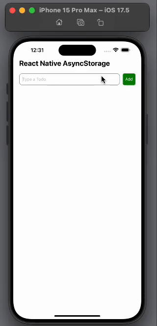

<h1>ASYNCSTORAGE CRUD APP</h1>

This application is a CRUD (Create, Read, Update, Delete) example built with React Native to showcase the features of AsyncStorage. It allows users to securely store their data locally and easily access it.

<h2> Framework </h2>

- React Native

<h2> Screen Gif </h2>

